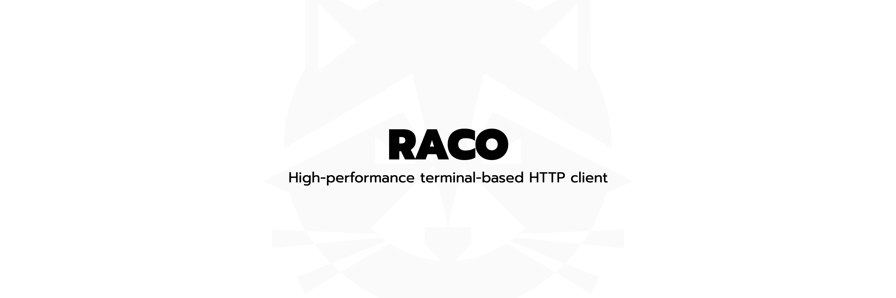

# Raco

High-performance terminal-based HTTP client

## Features

- 3-panel terminal UI (Sidebar, Request Panel, Response Panel)
- HTTP, WebSocket, and gRPC support
- File Upload/Download (multipart/form-data)
- Mouse & keyboard support
- Clipboard integration (Drag-to-select and auto-copy)
- Git-friendly storage (JSON/YAML)
- Environment variable support
- JSON auto-formatting
- Request History tracking
- Real-time Metrics Dashboard
- Command Palette for quick request access
- Fast HTTP client with timeout control
- Vim-style navigation
- Desktop notifications when the terminal is in the background (macOS/Linux)

## Installation

### Quick Install (Recommended)

**macOS/Linux:**
```bash
curl -sSL https://raw.githubusercontent.com/Queaxtra/raco/main/install.sh | sh
```

**Or using go install:**
```bash
go install github.com/Queaxtra/raco@latest
```

**Or using Make:**
```bash
make build    # Build binary
make install  # Build and install to /usr/local/bin
```

**Or manually:**
```bash
go build -o raco
sudo mv raco /usr/local/bin/
```

**Update to latest (when already installed):**
```bash
raco update
```

## Usage

### Mouse Support
- Click on any panel to focus it
- Click on collections to select
- Drag to select text and copy to clipboard automatically

### Keyboard Shortcuts

**Global (vim-style)**
- `q` / `Ctrl+C` - Quit
- `Tab` / `Shift+Tab` - Next / previous field or panel
- `h` / `l` - Focus sidebar / focus request panel
- `e` - Send request (execute)
- `w` - Save request (write)
- `:` / `/` / `Ctrl+P` - Command palette
- `Esc` - Unfocus / back
- `Ctrl+B` - Toggle sidebar
- `F1` - Dashboard

**Sidebar**
- `j` / `k` - Navigate down/up
- `gg` - First item (press `g` twice)
- `G` - Last item
- `Enter` - Expand/collapse collection or load request

**Request Panel**
- `Tab` / `Shift+Tab` - Next / previous input
- `←` / `→` or `h` / `l` - Change method (GET/POST/…/WS/gRPC)
- `e` / `Ctrl+R` - Send request
- `w` / `Ctrl+W` - Save request
- `Ctrl+S` / `Ctrl+D` - Add / delete header
- `Ctrl+F` / `Ctrl+X` - Add / remove file

**Response Panel**
- `j` / `k` - Scroll
- `Tab` / `h` - Back to sidebar
- `Esc` - Back

## Workflow

### Creating Collections
1. Press `Ctrl+N` to open collection creation modal
2. Type collection name and press `Enter`
3. Collection will appear in sidebar

### Saving Requests
1. Configure your request (URL, method, headers, body)
2. Press `Ctrl+W` to save
3. Enter request name and press `Enter`
4. Request will be saved to the currently expanded collection (or first collection if none expanded)

### Loading Requests
1. Navigate sidebar with `j/k`
2. Press `Enter` on a collection to expand/collapse
3. Press `Enter` on a request to load it
4. Press `Tab` to switch to request panel and modify if needed

### Using Command Palette
1. Press `Ctrl+P` to open the palette
2. Type to filter requests
3. Use `j/k` or `↑/↓` to navigate
4. Press `Enter` to load selected request

### Viewing Request History
1. Look for "History" section in sidebar
2. Use `j/k` to navigate to history entries
3. Press `Enter` on a history entry to reload it

### WebSocket / gRPC Connections
1. In Request Panel, use `←/→` to select WS or gRPC protocol
2. Enter the URL
3. Press `Ctrl+R` to connect
4. Type messages and press `Enter` to send
5. Press `Ctrl+Q` to disconnect

### Viewing Metrics Dashboard
1. Press `F1` anytime to open Dashboard
2. View request statistics, success rates, and recent activity
3. Press `Tab` or `Esc` to return to sidebar

### Desktop notifications

When you run a request (TUI or CLI) or a collection run, Raco can send an OS-level notification so you see the result even if the terminal is not focused:

- **TUI:** Every in-app toast (e.g. “Request saved”, “Connected”, errors) also triggers a desktop notification.
- **CLI `raco req`:** On success you get “Request completed: &lt;status&gt;”; on failure, “Request failed: &lt;error&gt;”.
- **CLI `raco run`:** After the run, you get “&lt;collection&gt;: X passed, Y failed”.

Supported platforms: **macOS** (via `osascript`), **Linux** (via `notify-send`; install `libnotify` if needed). Other platforms show no desktop notification.

## Storage

Collections: `~/.raco/collections/*.json`
Environments: `~/.raco/environments/*.yaml`

## Contributing

Contributions are welcome! Please fork the repository and submit a pull request with your changes. For major changes, please open an issue first to discuss what you would like to change.

## License

This project is licensed under the MIT License - see the [LICENSE](LICENSE) file for details.
